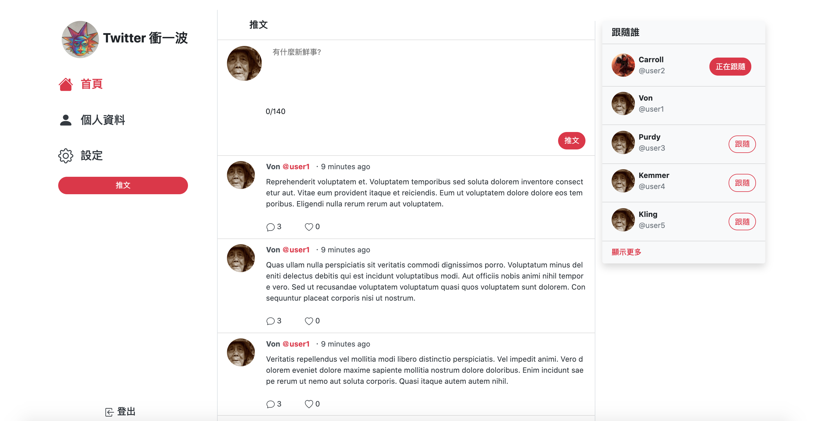
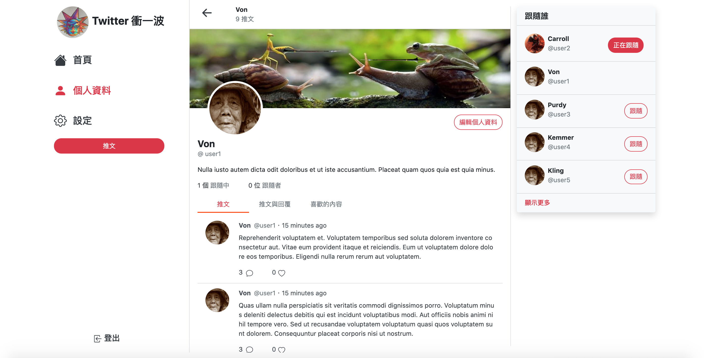
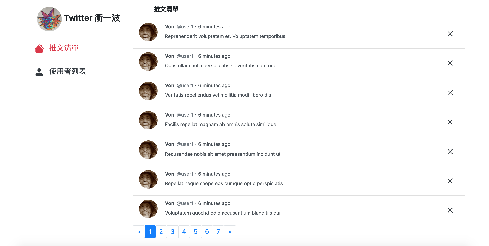

# :v: Simple Twitter :v:

This is a simple :v: twitter :v: clone fullstack project made with Express.js, Node.js, express-handlebars and MySQL. :v:

:point_right: [Project Link](https://limitless-refuge-46182.herokuapp.com/signin)

## Snapshots

### User




### Admin




## User Stories & Product Features

- Admin can view all the users
- Admin can view and delete all the tweets
- Users can post tweets
- Users can like/unlike tweets :heart:
- Users can reply to tweets :speech_balloon:
- Users can follow/unfollow users
- Users can edit account info
- Users can edit profile
- Users can view all the tweets
- Users can view tweets they liked
- Users can view tweets they replied to
- Users can view tweets they create
- Users cannot login to admin page
- Admin cannot login to user page

## Install & Usage

#### Download the project

```
git clone https://github.com/marcho001/twitter-fullstack-2020.git
```

#### Install Package

```
npm install
```

#### Establish MySQL Connection with MySQL Workbench

**default password: password**

```
drop database if exists ac_twitter_workspace;
create database ac_twitter_workspace;
use ac_twitter_workspace;
```

#### Create Table & Schema (run in vscode)

```
npx sequelize db:migrate
```

#### Run seed data

```
npx sequelize db:seed:all
```

#### Add .env file

```
IMGUR_CLIENT_ID = your imgur client ID
```

#### Run in development

```
npm run dev
```

#### Run start

```
npm start
```

#### View project

[http://localhost:3000](http://localhost:3000)

#### View project with test users

admin: [http://localhost:3000/admin/signin](http://localhost:3000/admin/sign)

```
email: root@example.com
password: 12345678
```

user: [http://localhost:3000/signin](http://localhost:3000/signin)

```
account: user1
password: 12345678
account: user2
password: 12345678
account: user3
password: 12345678
account: user4
password: 12345678
account: user5
password: 12345678
```

## Contributor

- [Billy-Chung](https://github.com/Billy-Chung) - Database Killer :fire::fire::fire:
- [marcho001](https://github.com/marcho001) - Front-End Specialist :trollface:
- [leey611](https://github.com/leey611) - Debuger :exclamation::exclamation::v:
