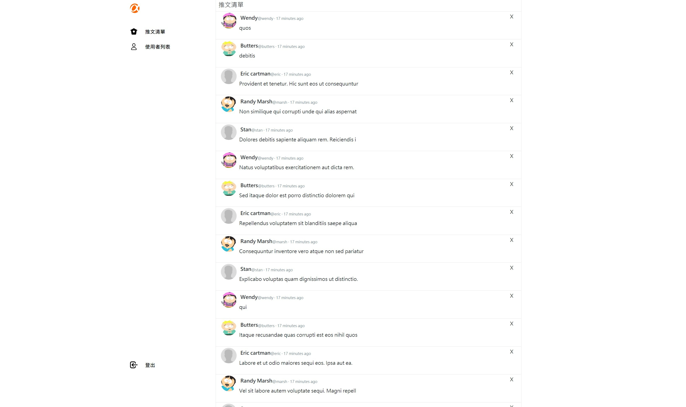
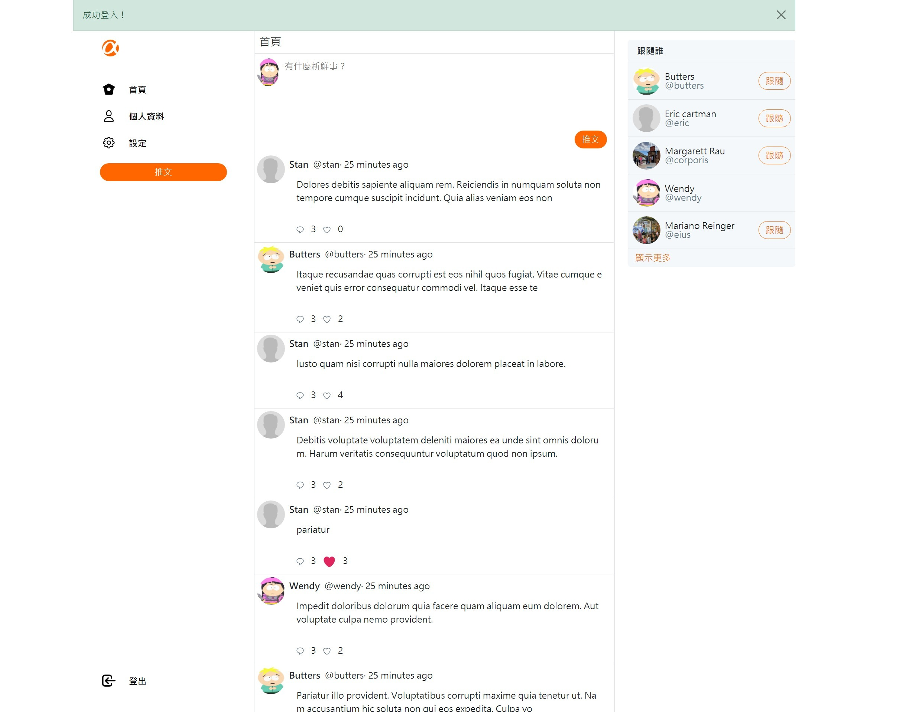

# Simple Twitter






## 功能
* 使用者在首頁看到所有人的 tweet
* 使用者可以點擊側邊的按鈕或直接在首頁上方的空白區輸入內容發佈屬於自己的推文
* 點擊任何一個 tweet 方塊，可以查看該 tweet 詳情及回覆串
* 點擊任何一個 tweet 方塊中的 reply 圖示，可以對該 tweet 進行回覆
* 可在首頁看到每一則 tweet 被喜歡的數量，以及被回覆的數量
* 使用者可以編輯自己的：帳號/名稱/email/密碼/大頭像/封面/自我介紹

## 設定安裝

Clone repository to your local computer

```bash
$ git clone https://github.com/changjandam/twitter-fullstack-2020
```

Into the project folder

```bash
$ cd twitter-fullstack-2020
```

Install by npm

```bash
$ npm install
$ npm i nodemon
```

建立 MySQL 連線 (帳號: root / 密碼: password)

在 MySQL Workbench 建立 database

```
create database ac_twitter_workspace;
```

執行 migration

```bash
npx sequelize db:migrate
```

執行 seeder

```bash
npx sequelize db:seed:all
```

參考 .env.example 建立屬於自己的 .env 檔

```bash
npm run dev
```

展示網址: https://safe-cliffs-40569.herokuapp.com/signin

admin:登入帳號 root@example.com，密碼 12345678
一般使用者:登入帳號 user1@example.com，密碼 12345678


## Built with
 * bcrypt-nodejs: 0.0.3
 * bcryptjs: 2.4.3
 * body-parser: 1.19.0
 * chai: 4.3.4
 * connect-flash: 0.1.1
 * dotenv: 10.0.0
 * express: 4.17.1
 * express-handlebars: 3.1.0
 * express-session: 1.17.2
 * faker: 4.1.0
 * imgur-node-api: 0.1.0
 * method-override: 3.0.0
 * mocha: 6.0.2
 * moment: 2.29.1
 * multer: 1.4.2
 * mysql2: 1.7.0
 * passport: 0.4.1
 * passport-local: 1.0.0
 * sequelize: 4.44.4
 * sequelize-cli: 5.5.0
 * sinon: 7.5.0
 * sinon-chai: 3.7.0


## Author
Jimmy, Kizuki, Elliot
