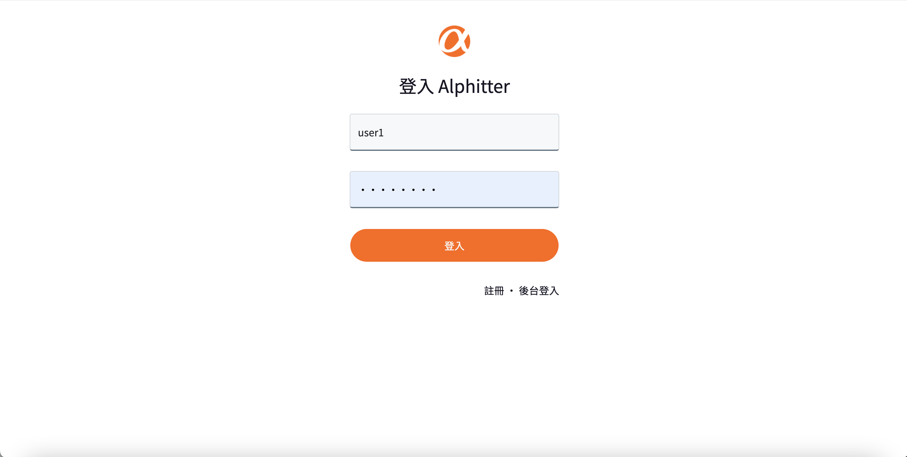
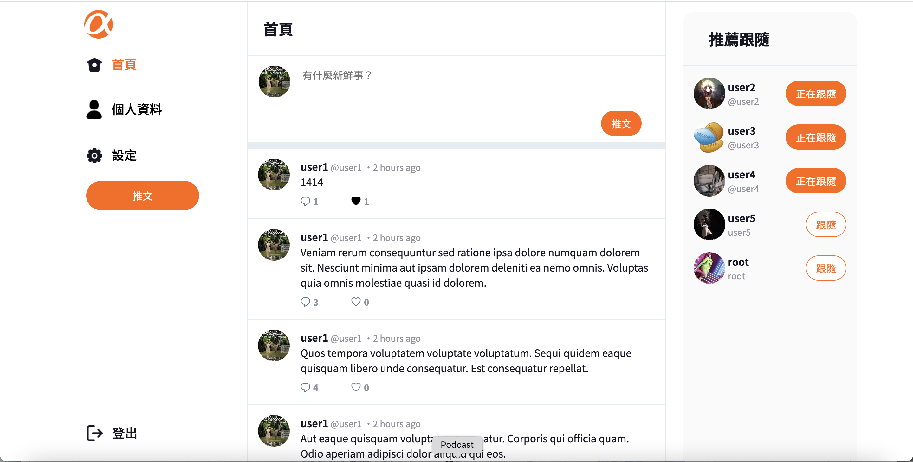

# Simple Twitter Platform



## 介紹
使用 Node.js & Express 打造的網站。 可以註冊帳號登入，使用一個類似Twitter的簡易社交平台！
### 功能

註冊/登入/登出：

- 使用者可以註冊自己的專屬帳號
- 使用者必須登入後才能使用此網站
- 使用者註冊必須符合註冊規範

使用者：

- 使用者可以新增/瀏覽/回覆推文，但必須符合系統規範
- 使用者可以瀏覽單一貼文的所有回覆
- 使用者可以點選按鈕對貼文表示Like/Unlike
- 使用者可以編輯自己的帳號、名稱、大頭照及封面照
- 使用者可以查看他人的基本資料
- 使用者可以追蹤/取消追蹤其他使用者
- 使用者能在首頁的側邊欄，看見跟隨者 (followers) 數量排列前 10 的推薦跟隨名單
- 使用者可以更新密碼
- 使用者帳號不可以登入管理者後台

管理者：

- 管理者可以在後台瀏覽所有貼文及刪除單一貼文
- 管理者可已在後台瀏覽所有使用者清單
- 管理者帳號不可以登入使用者前台

## 開始使用

1. 請先確認有安裝 node.js 與 npm
2. 將專案 clone 到本地
3. 環境變數設定： 將根目錄.env.example檔案中所需的資訊，建立一個.env檔案將其寫入
4. 根據/config/config.json對不同模式下的參數做設定
5. 建立資料庫：此專案為使用MySQL資料庫，前往 MySQL Workbench，新增兩個資料庫，開發環境用的，以及測試環境用的
   ```bash
   create database ac_twitter_workspace;
   create database ac_twitter_workspace_test;
   ```

6. 在本地開啟之後，透過終端機進入資料夾，進行初始化動作，輸入：
   ```bash
   npm install
   ```
7. 載入資料庫migration，輸入：
   ```bash
   npx sequelize db:migrate
   ```
8. 載入種子資料，輸入：
   ```bash

   npx sequelize db:seed:all

   ```
9. 安裝及設置完畢後，啟動專案：
   ```bash

   npm run start

   ```
10. 若看見此行訊息則代表順利運行，打開瀏覽器進入到以下網址
    ```bash

    Listening on http://localhost:3000

    ```
11. 暫停使用
    ```bash
    ctrl + c
    ```
## 測試帳號

前台帳號：

   ```bash
   account: user1
   email: user1@example.com
   password: 12345678
   ```

後台帳號：

   ```bash
   account: root
   email: root@example.com
   password: 12345678
   ```

## 開發者

- [MioRain](https://github.com/MioRain)
- [RogerHuang](https://github.com/RogerHuang0320)
- [AndyChien](https://github.com/AndyChienn)

## 開發工具

- Node.js 14.16.0
- express 4.16.4
- express-Handlebars 3.0.0
- express-session 1.15.6
- axios 0.19.2

- Bootstrap 5.0.2

- Font-awesome 6.1.2


- mysql2 1.6.4
- sequelize 6.18.0
- sequelize-cli 5.5.0
- bcryptjs 2.4.3

- body-parser 1.18.3
- connect-flash 0.1.1
- dotenv 16.0.1    
- method-override 3.0.0

- passport 0.4.0
- passport-local 1.0.0

- dayjs 1.11.4
- faker 5.5.3
- imgur 1.0.2
- multer 1.4.3