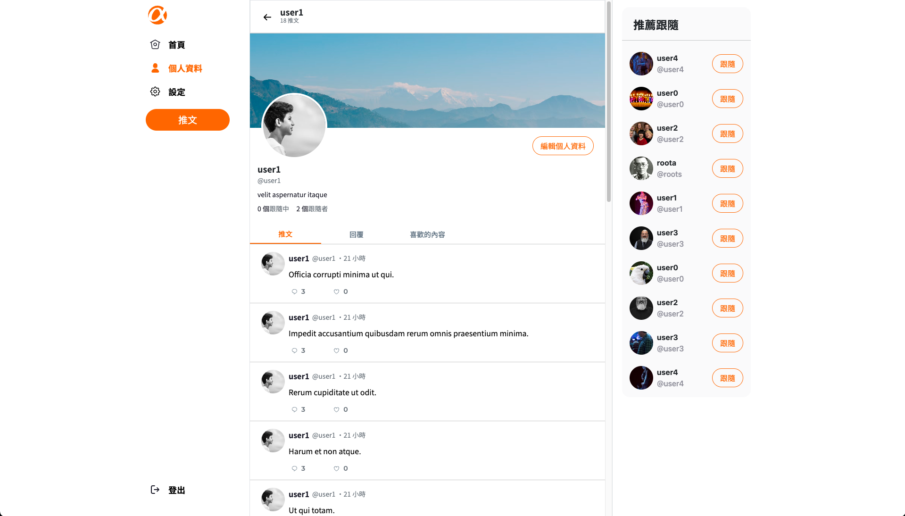

# Simple Twitter



## 簡介

一個參考 Twitter 打造的社交網頁，使用者可在頁面中探索新知、抒發感受、以及最重要的——認識新朋友。

---

## 功能

### ｜前台
- 註冊、登入
- 查看所有人的推文、回覆、喜歡的內容、跟隨的對象及被誰跟隨
- 新增推文
- 對貼文新增回覆
- 對貼文送出喜歡、取消喜歡
- 追蹤、取消追蹤其他使用者
- 編輯個人資料，包括姓名、email、密碼、個人介紹、頭像、封面照

### ｜後台
- 登入
- 查看所有人的推文，必要時可刪除貼文
- 查看所有人的數據統計，包含推文數、喜歡數、跟隨者數量及被跟被跟隨數量

---

## 專案初始化

### 1. 確認已安裝 node.js 、 npm

  - node.js 可透過nvm進行安裝,而 npm 會在安裝 node.js 自動下載。
  - nvm 安裝方式[傳送門](https://github.com/creationix/nvm)
  - node.js 安裝方式:
  ```bash
  $ nvm install 14.16.0
  ```

### 2. 開啟Terminal, 將此專案 Clone 到本地
``` bash 
$ git clone https://github.com/awei1127/twitter-fullstack-2020.git
```

### 3. 進入此專案資料夾
```bash
$ cd twitter-fullstack-2020
```

### 4. 安裝本專案 npm 套件
``` bash 
$ npm install
```

### 5. 參考 `.env.example` 檔案，重構 `.env` 環境

### 6. 設定資料庫
- 在 MySQL Workbench 輸入以下指令，
注意名稱需要與 config/config.json 一致

```
create database ac_twitter_workspace;
create database ac_twitter_workspace_test;
```

### 7. 設定資料
- 記得兩個環境都要執行
```bash
$ npx sequelize db:migrate
```

### 8. 建立種子資料
```bash
$ npx sequelize db:seed:all
```

### 9. 安裝、建立資料完畢接續輸入
```bash
$ npm run start
```

### 10. 當Terminal顯示以下訊息，代表伺服器已成功運行，可前往 http://localhost:3000 體驗

  ```
  Example app listening on port 3000!
  ```

### 11. 使用種子資料裡的測試帳號進行測試
``` bash
# 普通使用者測試帳號
account: user1
password: 12345678

# admin使用者測試帳號
account: root
password: 12345678
```

### 12. 若欲暫停使用

  ```
  ctrl + c
  ```

> !!
>
> 跑測試檔前提醒:
> - 記得要切換環境到 test 才能進行測試，避免原本資料被清空
> - ``` bash
>   $ export NODE_ENV=test
>   ```
> - 若不知道在哪個環境，可輸入以下指令檢查，
> 第一次輸入指令會回傳空白，代表正在使用 development 環境
> - ```bash
>   $ echo $NODE_ENV
>   ```
> !!

### 13. 執行測試
```bash
$ npm run test
```

### 14. Happy Coding!

---

## 開發環境與套件

### ｜主環境：
* VS Code - 編程環境
* node.js / express.js@4.16.4- 後端框架
* MySQL - 資料庫
* sequelize@6.18.0 - MySQL ORM

### ｜外觀：
* express-handlebars@5.3.3 - 樣板引擎
* handlebars-helpers@0.10.0 - 樣版引擎條件外掛
* bootstrap@5.0.2 - 切版、元件基礎樣式
* dayjs@1.10.6 - 時間處理
* multer@1.4.5-lts.1 - 圖片處理

### ｜登入功能：
* bcryptjs@2.4.3 - 密碼雜湊外掛
* passport@0.4.1 - 登入功能外掛
* passport-local@1.0.0 - 本地登入功能外掛
* connect-flash@0.1.1 - session 驗證資料暫存外掛
* express-session@1.15.6 - session 驗證外掛

### ｜其餘 Middleware：
* body-parser@1.18.3 - 解析資料外掛
* method-override@3.0.0 - 能以 http 動詞重構路由的外掛

### | 程式碼風格：
* eslint@8.42.0

---

## 專案貢獻者

* **[awei](https://github.com/awei1127)** 
* **[Tom Yung](https://github.com/goodjobhot401)** 
* **[Dong Wu](https://github.com/rr37)** 