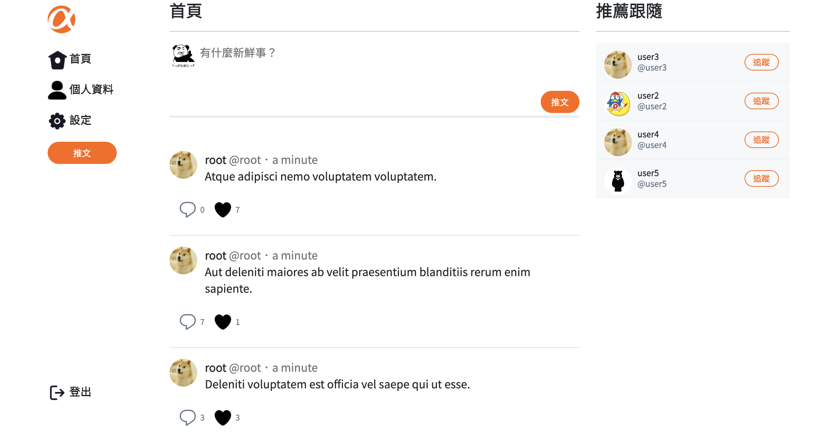
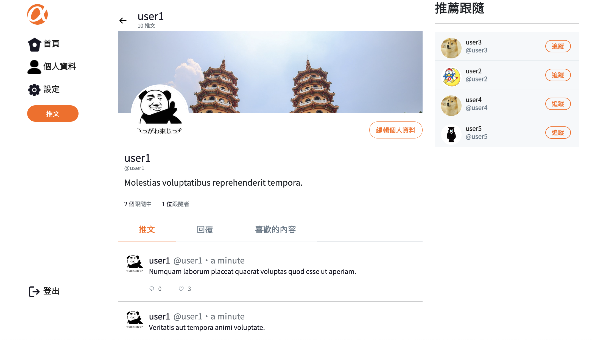

# Simple Twitter - full stack
使用基於node.js的express.js應用程式框架，全端開發simple twitter專案



## 專案功能
- 所有頁面(除了登入和註冊頁)
	- 使用者一定要登入才能使用網站。
	- 使用者能在首頁的側邊欄，看見跟隨者 (followers) 數量排列前 10 的推薦跟隨名單
	- 何登入使用者都可以瀏覽特定使用者的以下資料
		- 推文與回覆
		- 跟隨中
		- 跟隨者 
		- 喜歡的內容
- 登入
	- 當使用者尚未註冊便試圖登入時，會有錯誤提示。
	- 當使用者登入成功會進入首頁，會有登入成功提示。
	- 使用者點擊註冊會到註冊頁。
	- 使用者點擊後臺登入會到後臺登入頁。
- 註冊
	- 使用者可以設定帳號、名稱、email 和密碼
	- 當使用者輸入的帳號、email 與他人重複，若有重複會跳出錯誤提示
	- 當使用者註冊成功導到首頁，會有註冊成功提示。
	- 使用者點擊取消會到首頁。
- 帳戶設定頁
	- 使用者可以編輯帳號、名稱、email 和密碼
	- 當使用者輸入的帳號、email 與他人重複，若有重複會跳出錯誤提示
	- 使用者能編輯自己的名稱、自我介紹、個人頭像與封面
- 推文及回覆頁
	- 使用者能在首頁瀏覽所有的推文 (tweet)
	- 使用者點擊貼文方塊時，能查看貼文與回覆串
	- 使用者能回覆別人的推文
	- 使用者無法回覆他人回覆，也無法針對他人的按 Like/Unlike
	- 點擊貼文中使用者頭像時，能瀏覽該使用者的個人資料及推文
	- 使用者能新增140內的推文
	- 使用者可以追蹤/取消追蹤其他使用者 (不能追蹤自己)
	- 使用者能對別人的推文按 Like/Unlike
- 個人資料頁
	- 使用者能編輯自己的名稱、介紹、大頭照和個人頁橫幅背景
- 後台
	- 訪客可以自行註冊成為 user，但 admin 帳號無法自行註冊
	- 管理者可從專門的後台登入頁面進入網站後台
	- 管理者可以瀏覽全站的 Tweet 清單
	- 管理者可以瀏覽站內所有的使用者清單
## 安裝流程

1.將專案clone至本地端並開啟專案
2. .安裝`npm`套件，在終端機輸入:
```
npm install
```
或
```
npm i
```
3.環境變數設定 請參考.env.example檔案設定環境變數，並將檔名改為.env
```
IMGUR_CLIENT_ID= 
PORT=3000
```
4.更改連線至資料庫的username和password:
在config/config.json下，將development的username和password改為自己本地端資料庫的

5.建立資料庫
開啟 MySQL workbench，連線至本地資料庫，輸入以下指令建立資料庫 
```
drop database if exists ac_twitter_workspace;
create database ac_twitter_workspace;
use ac_twitter_workspace;
```
6.建立 MySQL Table，在終端機輸入：
```
npx sequelize db:migrate 
```
7.建立種子資料，在終端機輸入：
```
npx sequelize db:seed:all 
```
8.執行專案，在終端機輸入：
```
npm run dev
```
9.使用
如果連線成功，終端機出現下列訊息 "Example app listening on port 3000!"
則可開啟瀏覽器輸入 http://localhost:3000 使用

10.提供預設使用者 Seed User
| 帳號 | 密碼 |
| :------------- | :------------- |
| root  | 12345678 |
| user1 | 12345678 |
| user2 | 12345678 |
| user3 | 12345678 |
| user4 | 12345678 |
| user5 | 12345678 |

# 開發工具
- bcrypt-nodejs: 0.0.3
- bcryptjs: 2.4.3
- body-parser: 1.18.3
- chai: 4.2.0
- connect-flash: 0.1.1
- cross-env: 7.0.3
- express: 4.16.4
- express-handlebars: 3.0.0
- express-session: 1.15.6
- Bootstrap 5.0.2
- faker: 4.1.0
- jsonwebtoken: 8.5.1
- method-override: 3.0.0
- mocha: 6.0.2
- mysql2: 1.6.4
- passport: 0.4.0
- passport-jwt: 4.0.0
- passport-local: 1.0.0
- sequelize: 6.18.0
- sequelize-cli: 5.5.0
- sinon: 10.0.0
- sinon-chai: 3.3.0

# 共同開發人員

- [Quinn](https://github.com/KeYunTinG)
- [Mark Law](https://github.com/HKMark)
- [莊日嶸](https://github.com/robert1074004)
- [Merry](https://github.com/MerryHao)