# Simple Twitter
「Simple Twitter」是一個社群網頁，其開發是利用 Node.js 配合 Express 和 Handlebars 來完成的。

## Live Demo

### [Simple Twitter(使用AWS佈署)](http://simple-twitter-dev.ap-northeast-1.elasticbeanstalk.com/)

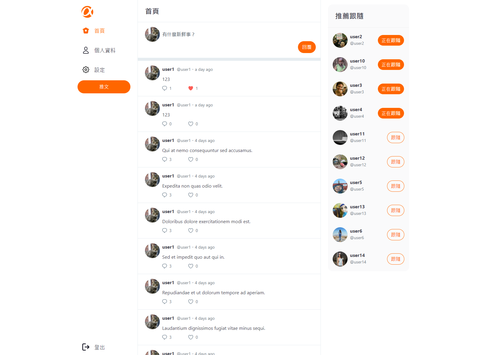

## 目錄

- [功能](#功能)
- [安裝專案](#安裝專案)
- [功能展示](#功能展示)
- [使用套件](#使用套件)
- [貢獻者](#貢獻者)


## 功能
### 登入系統
  - 使用者可以註冊帳號
  - 一般使用者只能登入前台
  - 管理員只能登入後台
### 前台 (一般使用者)
  - 使用者可以瀏覽所有的貼文
  - 使用者可以新增貼文
  - 使用者可以回覆貼文
  - 使用者可以對別人的貼文按 Like/Unlike
  - 使用者可以追蹤別人
  - 使用者可以瀏覽別人的個人資訊
  - 使用者可以編輯自己的個人資訊
### 後台 (管理員)
  - 管理員可以瀏覽所有的推文
  - 管理員可以刪除貼文
  - 管理員可以瀏覽所有的使用者清單

## 安裝專案

1. 請先確認有安裝 node.js 、 npm 與 mySQL 
2. 將專案 clone 至本地
3. 在本地開啟後，透過終端機進入資料夾，輸入 :

    ```bash
    npm install
    ```

4. 安裝完畢後，設定各項環境變數

   - 專案內有預設`.env.Example`, 將檔名中`.Example`刪除後，即可開始設定
   - 請先至 [imgur](https://api.imgur.com/oauth2/addclient)申請API後，獲得下列資訊並填上。([(參考)如何申請imgur API](https://israynotarray.com/nodejs/20220517/432259079/))
      ```bash
      CLIENT_ID= 'skip'
      CLIENT_SECRET= 'skip'
      REFRESH_TOKEN= 'skip'
      ```

5. 設定完畢後，請至 MySQL Workbench ， 輸入以下指令建立資料庫
    ```bash
    create database ac_twitter_workspace;
    ```

6. 資料庫建立完畢後，可以在終端機中輸入以下指令產生種子資料

    ```bash
    npm run dbmigrate
    ```

    ##### *預設提供 1 位管理員 以及 14 位一般使用者可以做測試
    | 使用者權限 | account | 密碼 |
    | :---: | :---: | :---: |
    | admin | root | 12345678 |

    ##### 一般使用者名稱造順序排列，且密碼皆為'12345678'
    | 使用者權限 | account | 密碼 |
    | :---: | :---: | :---: |
    | user | user1 | 12345678 |
    | user | user2 | 12345678 |
    | ... | ... | ... |
    | user | user14 | 12345678 |

7. 以上設定都完成之後，就可以輸入以下指令，使用專案囉!

    ```bash
    nap run start
    ```

    ##### 如果在終端機看到以下訊息，就代表順利運行，可以使用此網址進入網頁[http://localhost:3000](http://localhost:3000)
    ```bash
    Simple Twitter app listening on port 3000!
    ```

8. 若欲暫停使用

    ```bash
    ctrl + c
    ```

## 功能展示

### 登入
使用非admin帳號登入前台


帳號或密碼錯誤會有通知
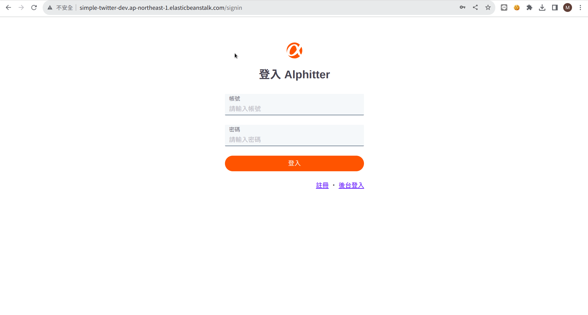

admin帳號不可以登入前台


user帳號不可以前往後台
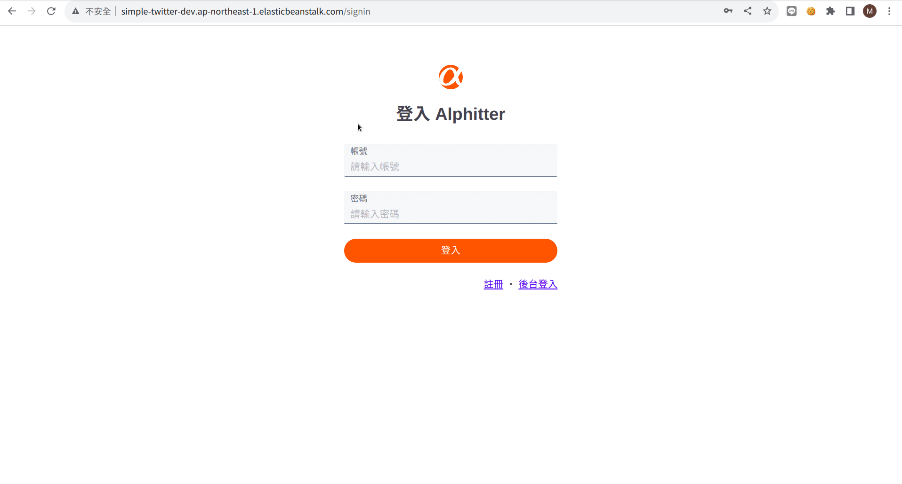
### 註冊
使用註冊頁面註冊，需要提供用戶名稱、帳號、密碼、密碼確認與信箱，註冊後頭項與背景為預設值
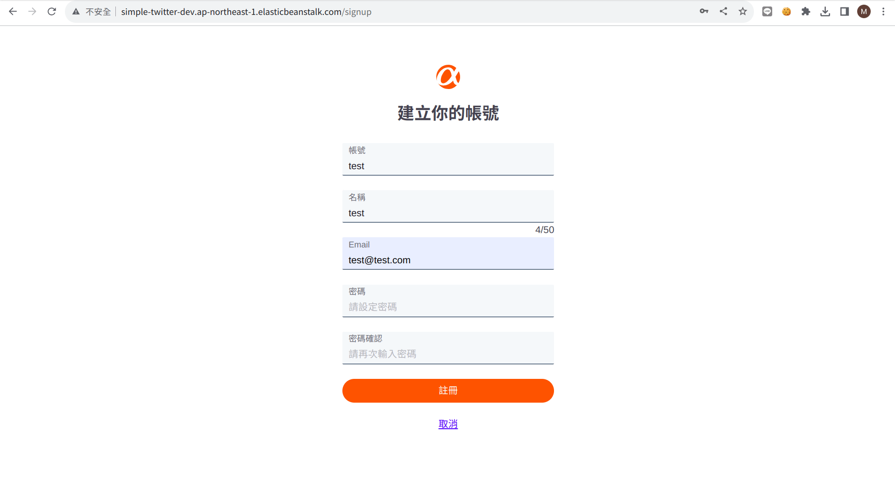

### 首頁
首頁可以查看自己與已追蹤使用者的所有貼文，依照時間順序最新的排最上面。
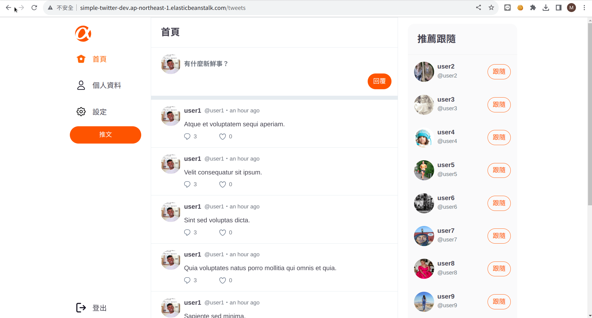

### 發送推文
點擊上方的「有什麼新鮮事？」區塊，就可以跳出推文Modal, 輸入與送交推文時，會檢查字數是否於1~140字之間，若不是則禁止上傳並出現提示字樣。
送交成功後會出現通知訊息。
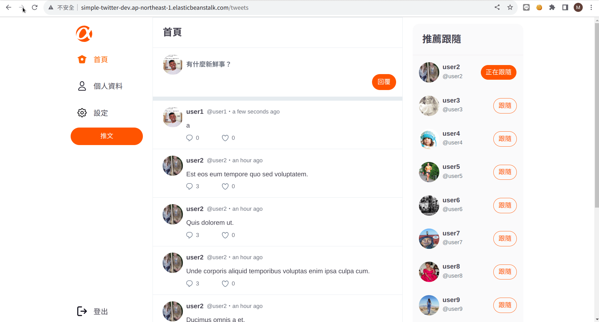

### 回復推文
點擊`/tweet`或`/reply`頁面上的對話框icon，就可以跳出回覆Modal, 輸入與送交回覆時，會檢查字數是否於1~140字之間，若不是則禁止上傳並出現提示字樣。
送交成功後會出現通知訊息。
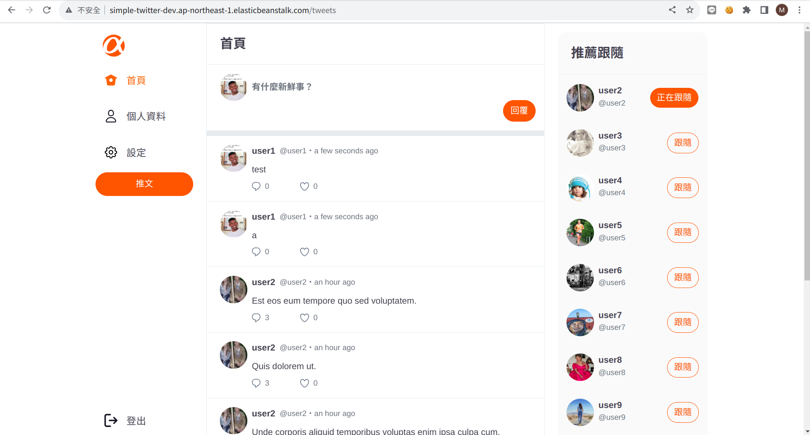

### 對貼文按Like/Unlike
點擊`/tweet`或`/reply`頁面上的愛心icon，可以對喜歡的推文like，愛心會變成紅色，再按一次可以unlike


### 追蹤使用者
點擊跟隨圖案可以跟隨用戶，並使該用戶的推文在`/tweets`上出現被追蹤者的tweets

### 個人介面
點擊左方「個人資料」可以進入登入用戶的個人界面
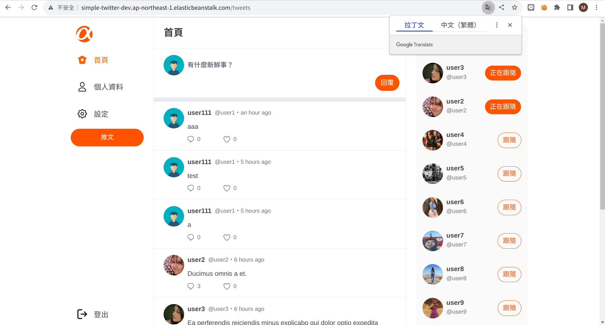

點擊任一頭像或名稱可以進入該用戶的個人界面
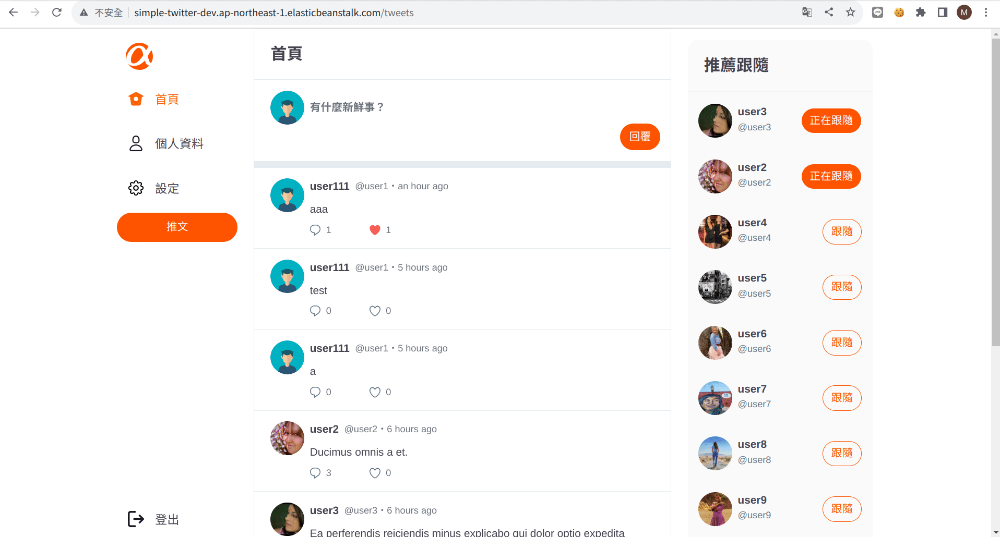

在「推文」中可以看到該用戶的所有推文，也可以在此處like或回覆此貼文


在「回覆」中可以看到該使用者所有的回覆，點擊後可以到`/reply`頁面查看原始推文


在「喜歡的內容」頁面可以看到該使用者所有喜歡的推文，如果在登入使用者的頁面取消喜歡，該推文會消失
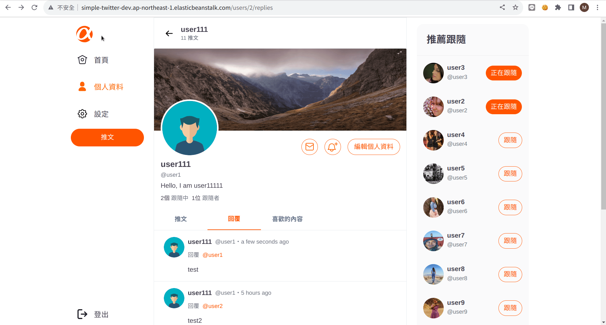

### 編輯個人資訊

個人頁面中點擊編輯個人資料可以修改頭像、背景、名稱與自我介紹，並有規定字數，若超過該字數則無法修改。
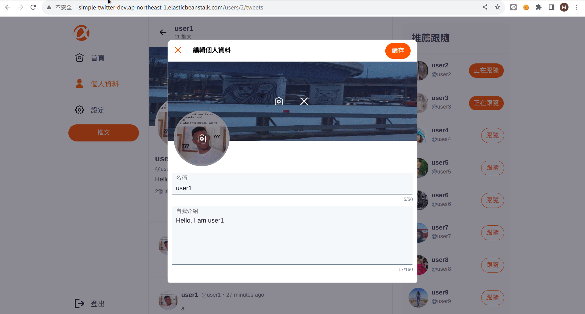

### [後台]登入
後台只能使用`admin`帳號才能登入
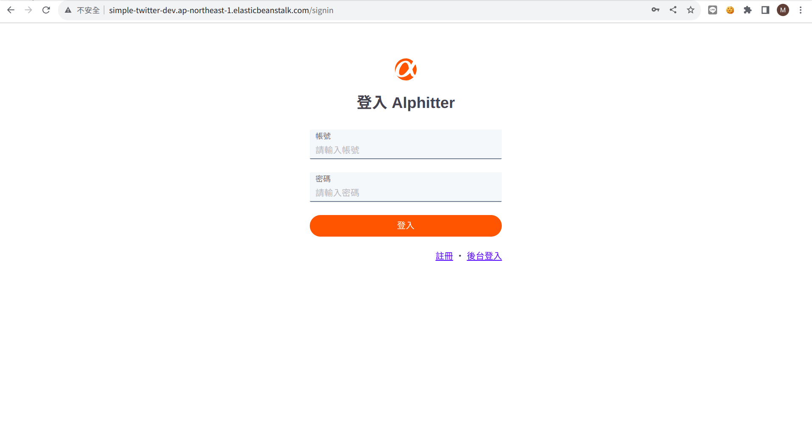

從後台前往前台會被阻止並跳出通知訊息


一般使用者不可登入後台
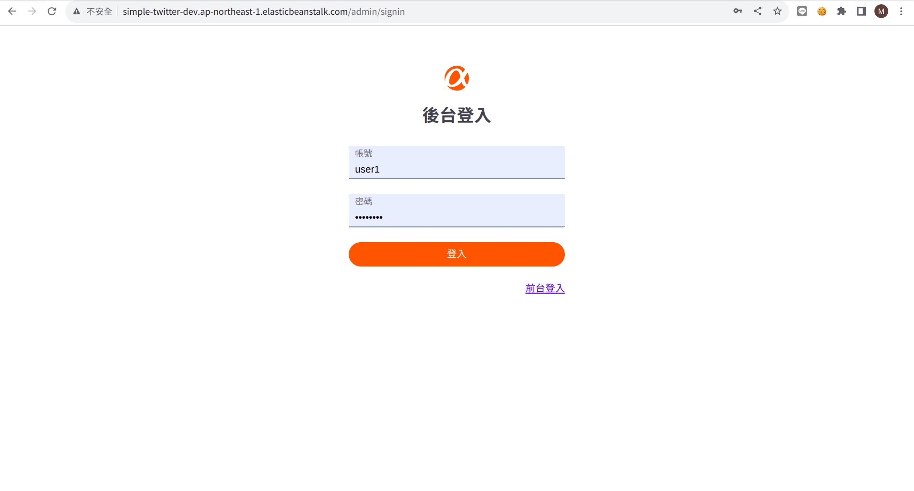

### [後台]首頁
「推文清單」中，依照tweets的建立時間順序由近至遠呈現所有tweets
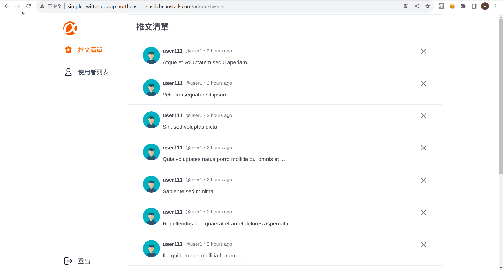

### [後台]刪除貼文

可以在「推文清單」的tweets右上角按下「X」可以刪除用戶的tweet
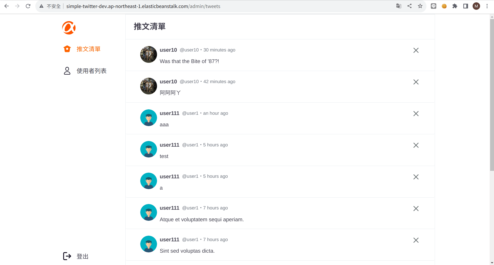

### [後台]查看所有使用者
在「使用者列表」中，`admin`以外的使用者依照他們所發送的tweets數量由多至少排序，已卡片形式排列。
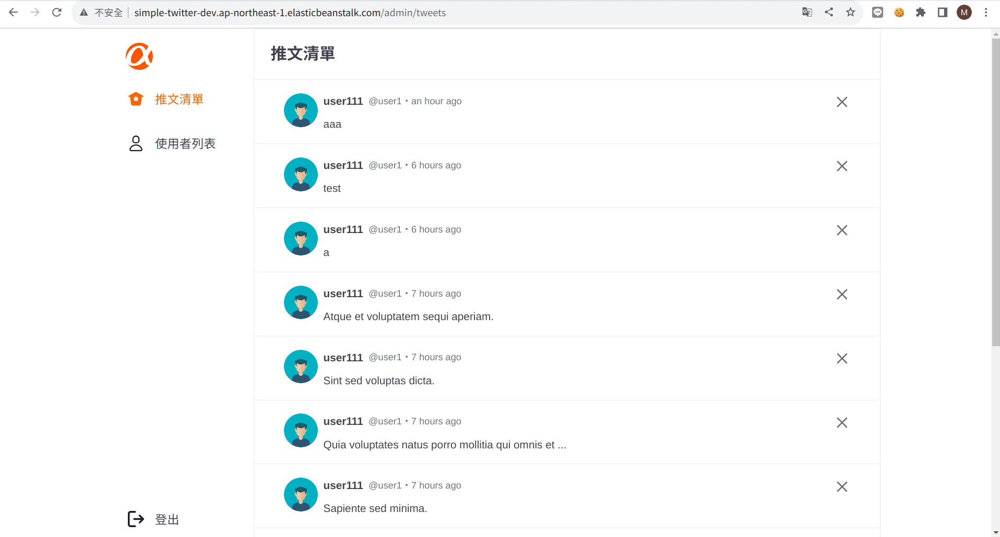

## 使用套件

### 主環境

| Package | version |
| :--- | :--- |
| Node.js | v20.5.1 |
| express | v4.16.4 |

### 資料庫

| Package | version |
| :--- | :--- |
| mysql2 | v3.6.0 |
| sequelize | v6.32.1 |
| sequelize-cli | v6.6.1 |

### 外觀

| Package | version |
| :--- | :--- |
| express-handlebars | v7.1.2 |
| connect-flash | v0.1.1 |
| dayjs | v1.11.9 |
| faker | v4.1.0 |
| imgur | v2.3.0 |
| multer | v1.4.5-lts.1 |

### 登入功能

| Package | version |
| :--- | :--- |
| passport | v0.6.0 |
| passport-local | v1.0.0 |
| express-session | v1.15.6 |
| bcryptjs | v2.4.3 |

### 其他

| Package | version |
| :--- | :--- |
| dotenv | v16.3.1 |
| method-override | v3.0.0 |

### 程式碼風格

| Package | version |
| :--- | :--- |
| prettier | v3.0.2 |
| eslint | v8.47.0 |

## 貢獻者

### [Tiny Murky](https://github.com/TinyMurky) | [iamcoolAlan](https://github.com/iamcoolalan) | [Taiwania](https://github.com/Taiwania)