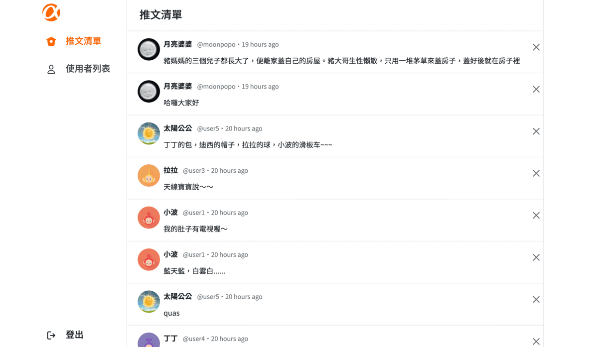
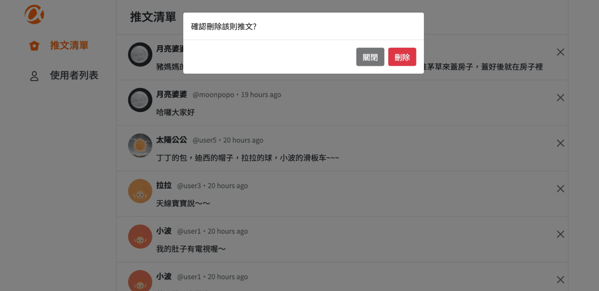

# Alphitter

Alphitter是一個簡易的twitter社群互動網站，提供使用者在註冊登入後，透過線上發文、留言、拜訪其他使用者主頁、追蹤其他使用者來建立朋友圈。

## 功能說明

- 提供前台個人帳號註冊、登入，帳號及Email不可重複註冊，帳號密碼及Email註冊後可再自行修改
- 可編輯暱稱、個人頭像、個人主頁首圖及自我介紹以展現個人風格
- 發布貼文、瀏覽全站貼文做出回覆及like
- 可追蹤其他使用者，可瀏覽全站粉絲最多的熱門使用者清單
- 透過點選頭像可以進入個別使用者主頁，在主頁除能看到該使用者的個人公開資訊，也能一次瀏覽該使用者的所有貼文、已做出的留言回覆、like過的貼文，以及其追蹤者及追蹤清單

## 安裝與執行

1. 安裝node.js and npm
2. 複製專案到本機
    ```
    git clone https://github.com/tingul4/twitter-fullstack-2023.git
    ```
3. 進入專案資料夾
    ```
    cd twitter-fullstack-2023
    ```
4. 安裝套件
    ```
    npm install
    ```
5. 在MySQL Workbench中分別建立開發/測試兩個資料庫
    >create database ac_twitter_workspace;
    >
    >create database ac_twitter_workspace_test;

6. 切換環境（開發/測試），並請確認當前切換至開發環境 

    *切換至開發環境*
    ```
    export NODE_ENV=development
    ```
    *切換至測試環境*
    ```
    export NODE_ENV=test 
    ```
    *確認當前環境*
    ```
    echo $NODE_ENV 
    ```
7. 執行資料庫及建立種子資料
    ```
    npx sequelize db:migrate
    npx sequelize db:seed:all
    ```
8. 啟動專案
    ```
    npm run dev
    ```

9. 看到以下訊息，可至瀏覽器輸入網址開啟 `http://localhost:3000/`
    ```
    Example app listening on port 3000!
    ```
10. 登入種子帳號 

    *前台*    
    > email: 'user1@example.com'   password: '12345678'
    >
    > email: 'user2@example.com'   password: '12345678'
    >
    > email: 'user3@example.com'   password: '12345678'
    >
    > email: 'user4@example.com'   password: '12345678'
    >
    > email: 'user5@example.com'   password: '12345678'
    
    *後台*    
    > email: 'root@example.com'   password: '12345678'

    或註冊前台帳號，登入後即可開始twitter社群互動

    *後台帳號需由開發人員在資料庫中手動建立*

## 畫面截圖

### 帳號註冊、登入


### 首頁：全站貼文、發文視窗


### 個人主頁、編輯個人資訊


### 瀏覽他人主頁


### 瀏覽貼文細節、回覆貼文


### 追蹤功能、追蹤頁、被追蹤頁


### 編輯帳號資料


### 後台管理員登入、推文清單管理、使用者列表





## 開發工具

- Express - The framework used
- MySQL - Database
- Heroku - Where API hosted