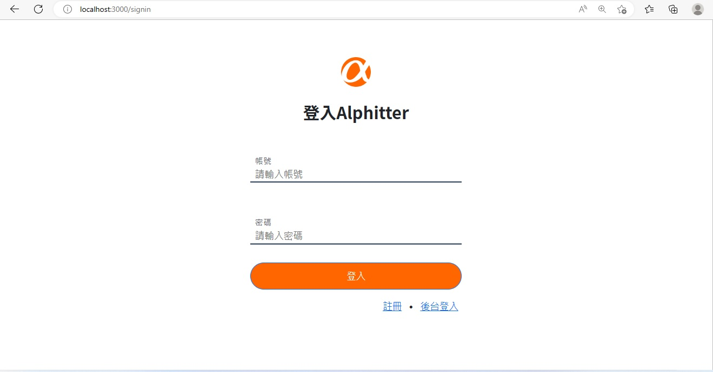

# Simple Twitter

使用 Node.js & Express 打造的類Twitter網站。

## 功能列表

- 註冊/登入/登出
  - 使用者一定要登入才能使用網站
  - 使用者註冊內容錯誤 或 與他人資料重複 及 登入失敗時，會看到對應的系統訊息
- 使用者
  - 使用者能在首頁瀏覽所有的推文
  - 使用者能新增推文
  - 使用者點擊貼文方塊時，能查看該則貼文的詳情與回覆串
  - 點擊貼文中使用者頭像時，能瀏覽該使用者的個人資料及推文
  - 使用者能回覆別人的推文
  - 使用者可以追蹤/取消追蹤其他使用者
  - 使用者能對推文按 喜歡/不喜歡
  - 使用者能編輯自己的名稱、介紹、大頭照和個人背景
  - 使用者能在首頁的側邊欄，看見跟隨者數量排列前 10 的使用者推薦名單
  - 使用者能在個人資料內，看見自己發布的貼文、回覆的文章、喜歡的貼文、追隨者及跟隨者
- 後台管理
  - 管理者可以瀏覽全站所有的使用者清單
  - 管理者可以瀏覽全站的推文清單
  - 管理者可以在推文清單上直接刪除任何人的推文

## 畫面預覽




## 安裝流程

1.開啟終端機將專案存至本機，在終端機輸入 :
```
git clone https://github.com/Rae-Lee/twitter-fullstack-2020.git
```
2.進入專案資料夾，在終端機輸入：
```
cd twitter-fullstack-2020
```
3.安裝`npm`套件，在終端機輸入：
```
npm install
```
4.環境變數設定 請參考.env.example檔案設定環境變數，並將檔名改為.env
```
IMGUR_CLIENT_ID= 
PORT=3000
```
5.建立資料庫
開啟 MySQL workbench，再連線至本地資料庫，輸入以下建立資料庫 
```
drop database if exists ac_twitter_workspace;
create database ac_twitter_workspace;
use ac_twitter_workspace;
```
6.建立 mySQL Table，在終端機輸入：
```
npx sequelize db:migrate 
```
7.建立種子資料，在終端機輸入：
```
npx sequelize db:seed:all 
```
8.執行專案，在終端機輸入：
```
npm run dev
```
9.使用
終端機出現下列訊息" "Example app listening on port 3000!"
可開啟瀏覽器輸入 http://localhost:3000 使用

10.預設使用者 Seed User
加入種子資料後，可使用下列預設帳號/密碼進行登入
| 帳號 | 密碼 |
| :------------- | :------------- |
| root  | 12345678 |
| user1 | 12345678 |
| user2 | 12345678 |
| user3 | 12345678 |
| user4 | 12345678 |
| user5 | 12345678 |

# 共同開發人員

- [lomo007](https://github.com/lomo007)
- [Rae-Lee](https://github.com/Rae-Lee)
- [ZHENG-YOU-LU](https://github.com/ZHENG-YOU-LU)
