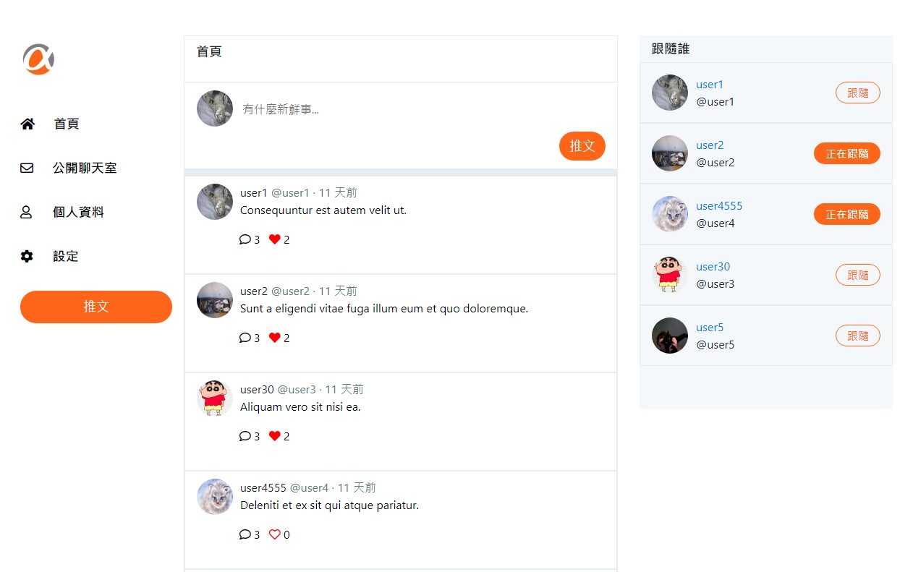
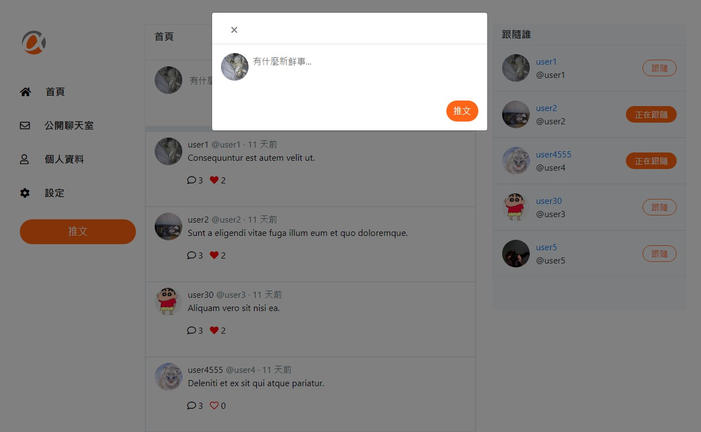

# Simple Twitter

由 ddssads, Jin, yun 共同合作
使用 Express, Node.js, Handlebars
製作一個功能類似 Twitter 的社群網站。

[專案網址](https://simple-twitter-fullstack.herokuapp.com)

# 專案畫面




# 功能描述 (features)

- 使用者需要創建帳號並登入
- 使用者需要登入才能使用網站
- 使用者能編輯自己的 account、name、email 和 password
- 使用者能編輯自己的自我介紹、個人頭像與封面
- 使用者能在首頁瀏覽所有的推文
- 使用者能查看該則推文的詳情與回覆串
- 使用者能回覆別人的推文
- 點擊推文中使用者頭像時，能瀏覽該使用者的個人資料及推文
- 使用者能新增推文
- 使用者可以追蹤/取消追蹤其他使用者 (不能追蹤自己)
- 使用者能對別人的推文按 Like/Unlike
- 管理者可從專門的後台登入頁面進入網站後台
- 管理者可以瀏覽全站的 Tweet 清單
- 管理者可以瀏覽站內所有的使用者清單

# 環境建置與需求 (prerequisites)

- "bcrypt-nodejs": "0.0.3",
- "bcryptjs": "^2.4.3",
- "body-parser": "^1.19.0",
- "chai": "^4.2.0",
- "connect-flash": "^0.1.1",
- "dotenv": "^8.2.0",
- "express": "^4.16.4",
- "express-handlebars": "^3.1.0",
- "express-session": "^1.17.1",
- "faker": "^4.1.0",
- "imgur": "^0.3.2",
- "imgur-node-api": "^0.1.0",
- "method-override": "^3.0.0",
- "mocha": "^6.0.2",
- "moment": "^2.29.1",
- "multer": "^1.4.2",
- "mysql2": "^1.6.4",
- "passport": "^0.4.1",
- "passport-local": "^1.0.0",
- "pg": "^8.5.1",
- "sequelize": "^4.42.0",
- "sequelize-cli": "^5.5.0",
- "sinon": "^7.2.3",
- "sinon-chai": "^3.3.0"

# 安裝與執行步驟(installation and execution)

1. 打開終端機(Terminal)，Clone 此專案至本地電腦

```
git clone https://github.com/ddssads/twitter-fullstack-2020.git
```

2. 開啟終端機，進入專案資料夾

```
cd twitter-fullstack-2020
```

3. 安裝 npm 套件

```
npm install
```

4. 使用 MySQL Workbench 建立資料庫

```
drop database if exists ac_twitter_workspace;
create database ac_twitter_workspace;
use ac_twitter_workspace;
```

5. 在終端機執行：把專案裡的 migration 設定檔同步到資料庫，並執行種子資料

```
npx sequelize db:migrate
npx sequelize db:seed:all
```

6. 執行 server

```
npm run dev
```

7. 開啟任一瀏覽器瀏覽器，輸入網址

```
http://localhost:3000
```

8. 種子資料中測試帳號

```
管理者： @root 12345678
使用者1~5： @user(1~5) 12345678
```

# Contributor

- [ddssads](https://github.com/ddssads)
- [Jin](https://github.com/Jin0704)
- [yun](https://github.com/yun856839)
