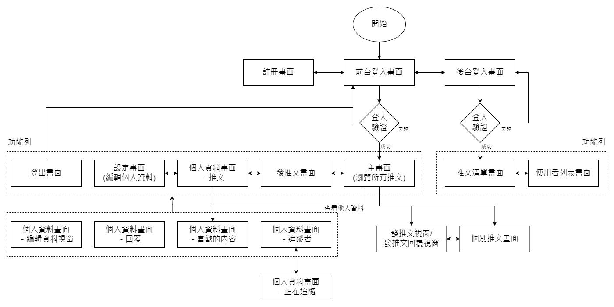

#My Simple Twitter

**可點擊[Demo](https://mighty-tundra-17871-5d8e08ab6f3e.herokuapp.com/signin) ，查看專案預覽！**

## 專案簡介
> 本專案係以Twitter(今已改名為X)的架構所打造社群網站。

此網站能提供以下服務：
1. 註冊及登入帳號：
  - **使用者能夠建立帳號，建立屬於自己的社群！**
  - 有針對註冊帳號及登入帳號進行錯誤處理。
  - 前後台登入路徑分離。
  - 透過身分驗證，能夠有效阻擋一般使用者進入後台，管理員也無法進入前台。
2. 個人頁面：
  - 使用者能夠修改帳號或密碼等登入資訊，且一樣會有驗證。
  - 使用者能夠新增自我介紹或上傳個人照片等個人資料設定，展現自我！
  - 使用者可以在個人頁面查看推文、回覆、或是喜歡內容的紀錄。
  - 使用者亦能查看追隨者和被追隨者的清單。
3. 社群互動：
  - 使用者能透過左側功能列的推文紐、或是首頁最上方的發文框，無時無刻發布推文。
  - 使用者亦能夠對喜歡的推文按下Like。
  - 使用者更能夠回覆有趣的推文，進行議題討論。
  - 使用者還能夠追隨對感興趣的用戶，擴展社群(當然，若是之後不感興趣也可以取消追隨)。
  - 主頁面右側會呈現前十大活躍用戶給使用者查看。
4. 後台監測：
  - 管理員可於後台查看推文清單，了解議題的脈動。
  - 管理員可於後台查看使用者活躍資料。
  - 管理員可於後台刪除不當言論，維持論壇環境。

## 環境需求與相關套件
1. Node.js
2. MySQL (MySQL Workbench 8.0)
3. npm(Node Package Manager)
4. 環境檔(.env)

## 專案安裝與執行步驟
1. 請先確認「環境建置與需求」第1和2點所提及的程式皆已安裝。
2. 將此專案clone到本地。
3. 初始化專案－開啟終端機，在專案資料夾執行：
```
cd [filePath]  # [filePath]為專案資料夾的路徑
npm init -y
```
4. 接著在終端機依序安裝套件(請見package.json的dependencies和devDependencies)：
```
# 安裝dependencies的套件
# 以"express": "^4.16.4"為例，執行
npm install express@4.16.4
```
```
# 安裝devDependencies的套件
# 以"proxyquire": "^2.1.3"為例，執行
npm install -D proxyquire@2.1.3
```
5. 環境檔－在目標資料夾新增副檔名為**env**的檔案，私密資訊皆紀錄在**env.example**，請自行設定到內文中。
```
# .env的內文
IMGUR_CLIENT_ID=[yourSecret] # [yourSecret]為您的私密資訊
```
6. 資料庫設定－請在終端機藉由Sequelize，將Migration和Model的設定導入到MySql中。
```
npx sequelize db:migrate
```
7. 種子資料－請將種子資料匯入DB，做為初始化的測試資料。
```
npx sequelize db:seed:all
```
8. 在終端機啟動伺服器，成功或失敗皆會有通知訊息。
```
# 啟動方法1
npm run start (node app.js)
```
```
# 啟動方法2
npm run dev (nodemon app.js)
```
9. 在瀏覽器輸入**http://localhost:3000**，即可連線。

## 相關設計
### 系統流程
